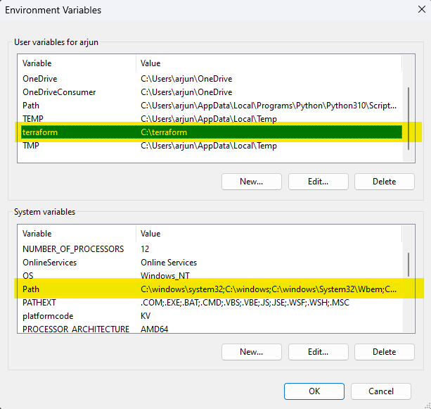
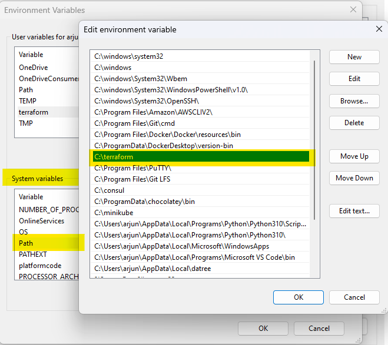

# Terraform Installation

> Hashicorp tutorial on Terraform installation
<p><a href="https://developer.hashicorp.com/terraform/tutorials/aws-get-started/install-cli?wvideo=r3yytnk1pr"></a></p><p><a href="https://developer.hashicorp.com/terraform/tutorials/aws-get-started/install-cli?wvideo=r3yytnk1pr"></a></p>

!> While doing manual installation, if terraform command doesn't work, just try to set the path right

```YAML
Go to Control Panel -> System -> System settings -> Environment Variables.
  - Scroll down in system variables until you find PATH.
  - Click edit and change accordingly.
  - BE SURE to include a semicolon at the end of the previous as that is the delimiter, i.e. c:\path;c:\path2
  - Launch a new console for the settings to take effect.
```

&emsp;

> Now let's try to check whether the installation is done the right way. Execute and check the code bellow to get the version 

```
terraform -v

Output :
  Terraform v*.*.*
  on windows_386
```
!> Where v*.*.* indicates version

## Basic Commands


| Command   |  Description                                          |
|:--------  | ----------------------------------------------------- |
|  init     |  Prepare your working directory for other commands    |
|  validate |  Check whether the configuration is valid             |
|  plan     |  Show changes required by the current configuration   |
|  apply    |  Create or update infrastructure                      |
|  destroy  |  Destroy previously-created infrastructure            |
